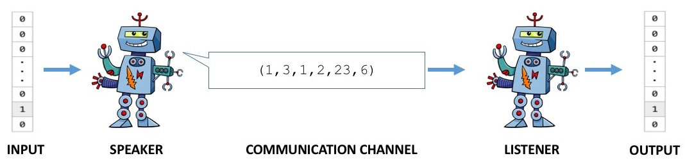
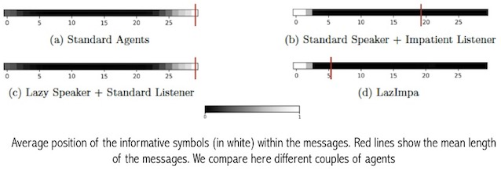

# LazImpa

This repository gathers the code used for all the experiments of the following paper:

- [*“LazImpa”: Lazy and Impatient neural agents learn to communicate efficiently* Mathieu Rita, Rahma Chaabouni, Emmanuel Dupoux. (CoNLL 2020)](https://www.aclweb.org/anthology/2020.conll-1.26/) [(Arxiv)](https://arxiv.org/abs/2010.01878)

You can see the presentation of the paper by clicking on this link: [🎥 Paper presentation](https://slideslive.com/38939488)

The code is an extension of EGG toolkit (https://github.com/facebookresearch/EGG) presented in *EGG: a toolkit for research on Emergence of lanGuage in Games*, Eugene Kharitonov, Rahma Chaabouni, Diane Bouchacourt, Marco Baroni. EMNLP 2019.

## 📋 Presentation

#### The game



`LazImpa` repository implements a Speaker/Listener game where agents have to cooperatly communicate in order to win the game. The Speaker receives an input (one-hot vector) it has to communicate to the Listener. To do so, it sends a message to the Listener. The Listener consumes the message and output a candidate. The agents are then succesful if the Listener correctly reconstructes the ground-truth input.

#### Aim of the paper

Previous experiments showed that Standard agents surprisingly develop non efficient codes. In particular, the language that emerges does not bear core properties of natural languages such as compositionality or length efficiency. In the paper, we study the latter property, Zipf's Law of Abbreviation (ZLA) that states that the most frequent messages are shorter than less frequent ones. We study the influence of humanly plausible constraints on length statistics. We particularly introduce a new communication system *LazImpa* composed of a Lazy Speaker and an Impatient Listener. The first is made increasingly lazy (least effort) while the second tries to guess the intended content as soon as possible. We show that near-optimal codes can emerge from this communication system.

#### Main paper results

- **LazImpa** allows the emergence of an efficient code that follows Zipf's Law of Abbrevation. On the contrary, the code that emerges from Standard Agents is not efficient and almost all message lengths are equal to the maximum length set by the user.

- With the settings of the paper, we show that agents are able to reach the performances of natural languages but do not manage to converge toward Optimal Coding (we explore causes of sub-optimality in the paper).

Length statistics are shown in the following figure:

 (**UPDATE LA LEGENDE**)

- We analyze the effects of the modelling choices and especially **the position of information** within the messages (see the definition of informative symbols in the paper). We show that Standard Agents (LSTMs) tend to place informative symbols at the end of the messages. On the contrary, the introduction of Impatient Listener causes a shift of information at the beginning of the messages. While regularization (Lazy Speaker) is impossible with a Standard Listener, messages are well shortened with Impatient Listener. We suggest that the location of information within the messages is crucial for length regularization.

The average position of informative symbols is shown in the following figure (red lines mark the average message length). We test different couples of agents:



## 💻 Run the code

We show here an example of experiment that can be run on Google Colab (smaller input space than in the paper). We also provide a [notebook](LazImpa_notebook.ipynb) that can directly be run in Colab to quickly reproduce our results on a smaller input space. In `example`, we also put an agents weights of an experiment in order for you to see the final communication that arises at the end of a training (run Section III-1 of the notebook with those weights). The command line that should be run to reproduce our paper results (larger input space) are reported below in the section [Reproductibility](http://github.com/MathieuRita/Lazimpa#Reproductibility).

#### Command lines

**1. Clone the repository**

First clone the repository and create a directory in which all the useful data will be saved (you have to respect the following hierarchy):
```
git clone https://github.com/MathieuRita/Lazimpa.git
mv "./Lazimpa/egg" "./egg"
```

```
mkdir -p dir_save/{accuracy,messages,sender,receiver}
```

**2. Train agents:**

```
python -m egg.zoo.channel.train   --dir_save=dir_save --vocab_size=40 --max_len=30 --impatient=True --reg=True --n_features=100 --print_message=False --random_seed=7 --probs="powerlaw" --n_epoch=401 --batch_size=512 --length_cost=0. --sender_cell="lstm"  --receiver_cell="lstm" --sender_hidden=250 --receiver_hidden=600 --receiver_embedding=100 --sender_embedding=10 --batches_per_epoch=100 --lr=0.001 --sender_entropy_coeff=2. --sender_num_layers=1 --receiver_num_layers=1 --early_stopping_thr=0.99
```

**3. Analyze the results:**

Create a directory in which useful analytical data will be saved:

```
mkdir analysis
```

Once agents are trained, you can reuse the agents weights saved in `dir_save/sender` and `dir_save/receiver` to test the agents (forward pass of all the different inputs). We put in `example` an example of agents weights when trained with the latter protocol :

```
python -m egg.zoo.channel.test --impatient=True --save_dir="analysis/" --receiver_weights="/dir_sav/receiver/receiver_weights500.pth" --sender_weights="/dir_save/sender/sender_weights500.pth" --vocab_size=40  --max_len=30 --n_features=100 --sender_cell="lstm" --receiver_cell="lstm" --sender_hidden=250 --receiver_hidden=600 --receiver_embedding=100 --sender_embedding=10 --sender_num_layers=1 --receiver_num_layers=1
```

When running the code, a file `messages_analysis.npy` will be saved in `analysis` desplaying the messages used by Agents. If `--impatient=True`, an additional file `prediction.npy` will be saved showing all the intermediate predictions of Impatient Listener

You can also perform the *information test* presented in the paper by running the following line:

```
python -m egg.zoo.channel.position_analysis --save_dir="analysis/" --impatient=True --sender_weights="dir_save/sender/sender_weights500.pth" --receiver_weights="dir_save/receiver/receiver_weights500.pth" --vocab_size=40 --n_features=100 --max_len=30 --sender_cell="lstm" --receiver_cell="lstm" --sender_hidden=250 --receiver_hidden=600 --receiver_embedding=100 --sender_embedding=10 --sender_num_layers=1 --receiver_num_layers=1
```

A file `position_sieve.npy` will be saved showing which symbols are informative.

####  H-parameters description

H-params can be divided in 3 classes: experiment settings, architecture H-params, optimization H-params, backup H-params. Here is a description of the main H-parameters:

1. Experimental settings:
- `vocab_size`: size of vocabulary in the communication channel (default=40)
- `max_len`: maximum length of the message in the communication channel (default=30)
- `n_features`: dimensionality of the concept space (number of inputs)
- `probs`: frequency distribution of the inputs (default=`powerlaw`)

2. Architecture H-params:
- `impatient`: if set to `True`, the Receiver is made Impatient
- `reg`: if set to `True`, the Sender is made Lazy
- `sender_cell`: type of Sender recurrent cell (in the whole paper: `lstm`)
- `sender_hidden`: Size of the hidden layer of Sender
- `sender_embedding`: Dimensionality of the embedding hidden layer for Sender
- `sender_num_layers`: Number hidden layers of Sender
- `receiver_cell`: type of Sender recurrent cell (in the whole paper: `lstm`)
- `receiver_hidden`: Size of the hidden layer of Receiver
- `receiver_embedding`: Dimensionality of the embedding hidden layer for Receiver
- `receiver_num_layers`: Number hidden layers of Receiver

3. Optimization H-params:
- `n_epochs`: number of training episodes
- `batches_per_epoch`: number of batches per training episode
- `batch_size`: size of a batch
- `lr`: learning rate
- `sender_entropy_coeff`: The entropy regularisation coefficient for Sender (trade-off between exploration/exploitation)
- `length_cost`: penalty applied on message length (if `reg` is set to `True`, this penalty is schedulded as done in the paper)

## 🔬 Comparison with other models and reference distributions

Based on the previous section, a small comparison between LazImpa and other models can be made (code in the [notebook](LazImpa_notebook.ipynb) ). We consider the different models: Standard Speaker + Standard Listener ; Standard Speaker + Impatient Listener ; Lazy Speaker + Standard Listener, Optimal Coding, Natural Languages (Arabic, English, Russian, Spanish). See details of this comparison in the paper.

##### Length performances

The first plot show the evolution of the length distribution of the messages (they are ranked by their frequency), the evolution of the accuracy and the evolution of the mean length.


- LazImpa is the only efficient and ZLA-obeying artificial model. We see that both Impatient Listener and Lazy Speaker do not lead alone to the emergence of an efficient code.
- The code that emerges from LazImpa reaches natural languages effiiency but is slightly sub-optimal.

##### Positional encoding

The next plot shows the position of informative symbols within the messages (green: informative symbols ; yellow: uninformative symbols ; purple: no symbol). See the definition of informative symbols and the test protocol in the paper.


- With the introduction of Impatient Listener, all the informative symbols are set at the beginning of the messages. With Standard Listener, most of the information tends to be set at the end of the messages.
- The position of information within the messages may explain why regularization works with Impatient Listener but does not work with Standard Agents

## 🌍 Reproductibility

##### LazImpa

To reproduce the results obtained in the paper for LazImpa, just run the following command line. Please note that the running time is quite long (in the paper we average our results on different seeds, feel free to test different values).

```
python -m egg.zoo.channel.train   --dir_save=dir_save --vocab_size=40 --max_len=30 --impatient=True --reg=True --n_features=1000 --print_message=False --random_seed=1 --probs="powerlaw" --n_epoch=2501 --batch_size=512 --length_cost=0. --sender_cell="lstm" --receiver_cell="lstm" --sender_hidden=250 --receiver_hidden=600 --receiver_embedding=100 --sender_embedding=10 --batches_per_epoch=100 --lr=0.001 --sender_entropy_coeff=2. --sender_num_layers=1 --receiver_num_layers=1 --early_stopping_thr=0.99
```

##### Emergent language baselines

If you also want to reproduce the baselines shown in the paper, you just have to play with the Hparams `impatient` and `reg` (the other Hparams can be unchainged):

- *LazImpa* : `impatient=True`, `reg=True`
- *Standard agents*: `impatient=False`, `reg=False`
- *Standard Listener + Lazy Speaker*: `impatient=False`, `reg=True`
- *Impatient Listener + Standard Speaker*: `impatient=True`, `reg=True`

##### Natural Languages

To reproduce the natural language curves, please find the corpus here: [Natural languages corpus](http://corpus.leeds.ac.uk/serge/).

##### Optimal coding

Optimal coding is a theoretical optimal distribution. It is merely constructed by associating the shortest messages to the most frequent inputs (under the constraint that all the messages are different given a vocabulary size), so that Optimal Coding minimizes the sum of message lengths averaged by their frequency.

## ✒️ How to cite ?

```
@inproceedings{rita-etal-2020-lazimpa,
title = "{``}{L}az{I}mpa{''}: Lazy and Impatient neural agents learn to communicate efficiently",
author = "Rita, Mathieu  and
Chaabouni, Rahma  and
Dupoux, Emmanuel",
booktitle = "Proceedings of the 24th Conference on Computational Natural Language Learning",
month = nov,
year = "2020",
address = "Online",
publisher = "Association for Computational Linguistics",
url = "https://www.aclweb.org/anthology/2020.conll-1.26",
pages = "335--343",
abstract = "Previous work has shown that artificial neural agents naturally develop surprisingly non-efficient codes. This is illustrated by the fact that in a referential game involving a speaker and a listener neural networks optimizing accurate transmission over a discrete channel, the emergent messages fail to achieve an optimal length. Furthermore, frequent messages tend to be longer than infrequent ones, a pattern contrary to the Zipf Law of Abbreviation (ZLA) observed in all natural languages. Here, we show that near-optimal and ZLA-compatible messages can emerge, but only if both the speaker and the listener are modified. We hence introduce a new communication system, {``}LazImpa{''}, where the speaker is made increasingly lazy, i.e., avoids long messages, and the listener impatient, i.e., seeks to guess the intended content as soon as possible.",
}
```
